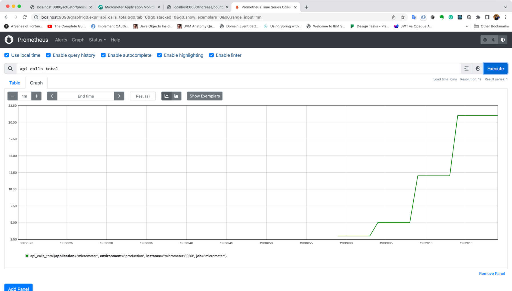

# spring-micrometer-demo

#### build images: 
   
```shell script

   mvn clean install 

   docker build -t micrometer -f ./target/docker-resources/Dockerfile ./target

``` 
#### deploy containers:
    
    docker-compose up -d

#### stop containers:
    
    docker-compose stop

#### remove containers:
    
    docker-compose rm -f
####
Browse url - http://localhost:8080/increase/count



#### URLs:
    
    http://localhost:8080/actuator/prometheus
    http://localhost:9090/
